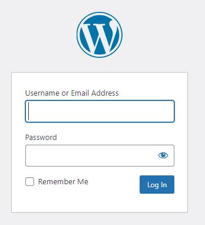
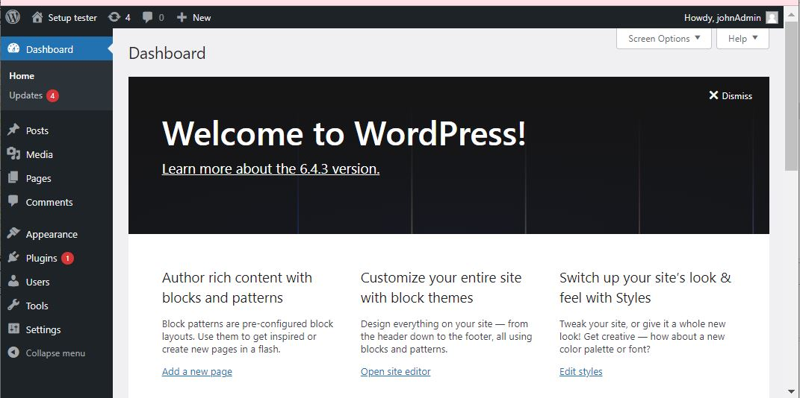
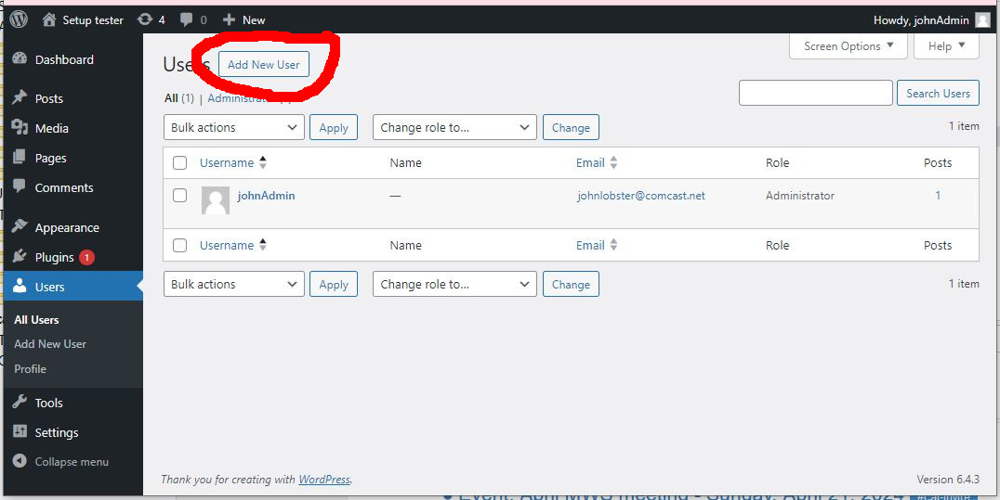
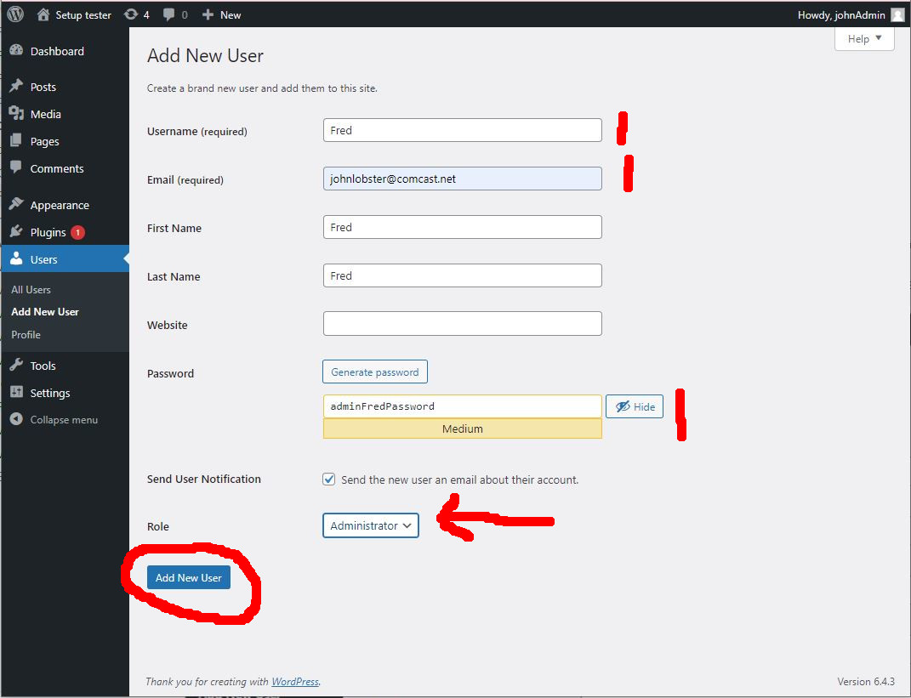
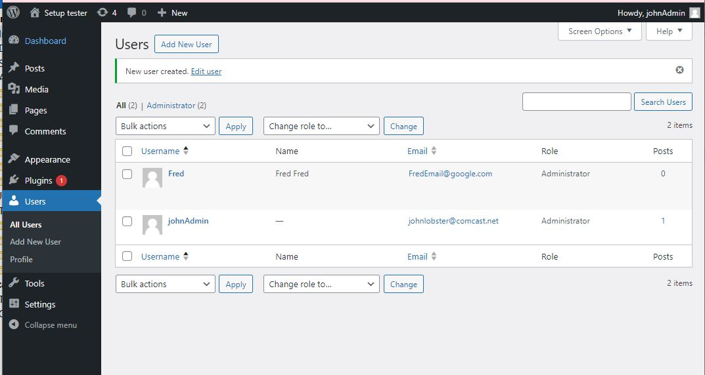
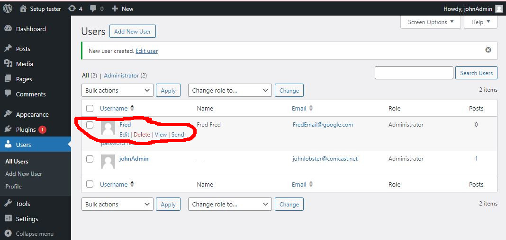
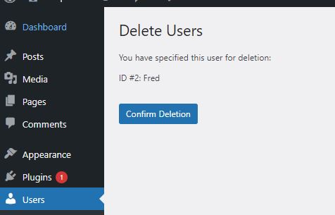
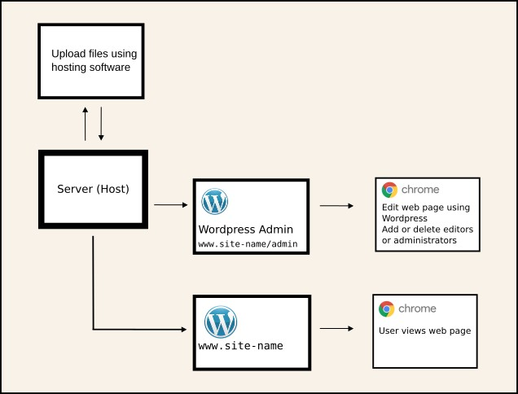

# Adding and removing people from WordPress admin

### Allowing developer access to a website

To be able to edit a web site, a developer typically needs access to
- hosting service
- WordPress as an admin for the website

This article contains
- How to add an admin user to the website
- How to remove a user from the website
- Overview of WordPress 

Access to the website hosting service depends on the hosting service. Some services have the ability to add someone as a developer, with their own log in ID

The examples are taken from a local WordPress site running on my computer 

### Adding someone as WordPress admin

Log on as administrator. Go to `www.your-site/admin`

A screen similar to this will appear. It may not be exactly the same as WordPress versions change, but the menu down the left hand side should be similar

The admin version of the site has lots of capabilities. Click on users on the left hand side, then click on "Add new user", circled in red on the image

The items marked in red must be filled in. Make sure you keep a record of the password. Use the user's email. Cannot be the same as the email of another user

The pull down menu marked with the red arrow gives the kind of user you want to create. For a developer working on the website, select the "Administrator" option. Then click on "Add New User" at the bottom, circled in red in image

After clicking "Add New User", should get a screen similar to this one

### Removing Wordpress admin access

At the end of the project, you may want to remove the developer so that they no longer have admin access to the website

Log on as admin as before and from the control panel, click on users. Hover over the user to be deleted and click delete

Check the name and click "Conform Deletion"

This will take you back to the list of users - the user you selected will have been removed

### WordPress overview

WordPress is software that runs on a host server. Although it is possible to get free hosting, it is usually with a paid service that has it's own software. The host software can create a blank WordPress site, upload (or download) files and start the WordPress system so that it can then be accessed by a web browser. Methods to do these things are specific to the hosting service

WordPress can be accessed either as a user or as an administrator

`www.site-name` accesses the user view

`www.site-name/admin` accesses the admin view, and requires login. The admin view has lots of different tabs and menus and can be used to edit the site, change theme or add WordPress packages. Once the site has been set up, this is the main way to access and change the site

